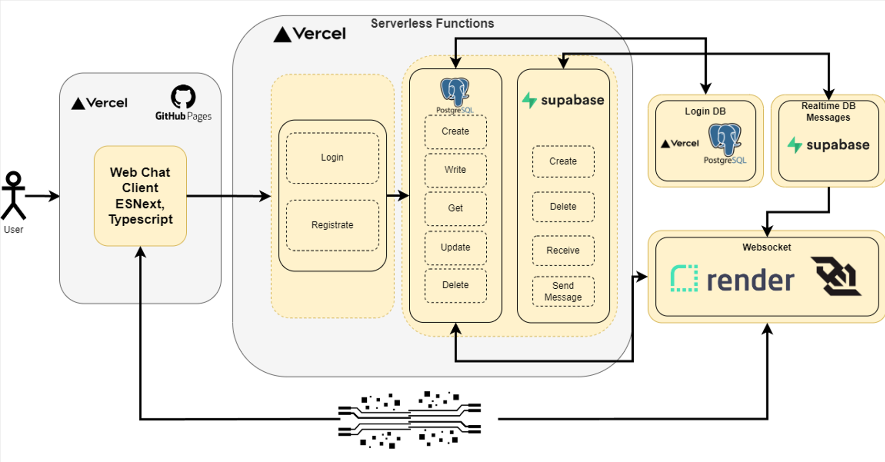

  

# Welcome & how to use
 1. Go to [LaVida Web Page](https://vale-sch.github.io/lavidaWeb/website/html/laVidaChat.html)
 2. Registrate yourselve
 3. Login in with your credentials 
 4. Write with your friends. Have Fun!

# Inspect the Code

 - [LaVida Web Client](https://github.com/vale-sch/lavidaWeb)
 - [LaVida Server](https://github.com/vale-sch/lavidaServer) -> linked and deployed on Vercel
 - [LaVida WebSocket](https://github.com/vale-sch/laVidaWebSocket) -> linked and deployed on Render

# Documentation
#### Special features
- Realtime Messaging via Supabase Realtime DB functionality. 
- Realtime Updating of whole Chat States (Active, Requested, Deleted)
- No Mobile Phone Number Required | Web Client only

### Web app process
The repository contains all the client-side code. From the displaying frontend code (*HTML, CSS, Typescript*), to addressing the serverless API endpoints of PostgresSQL (Vercel), Supabase DB and the WebSocket.  [LaVida Web Repo](https://github.com/vale-sch/lavidaWeb)

	  

- If no account exists yet, the user must create a new account via the registration process. This is saved in the Postgres database with the credentials and other important information for the chat to function later. 
	- [Registration Typescript](https://github.com/vale-sch/lavidaWeb/blob/main/typescript/Registration.ts) |  [Registration HTML](https://github.com/vale-sch/lavidaWeb/blob/main/website/html/registration_page.html)
	- [Registration - Deployed](https://vale-sch.github.io/lavidaWeb/website/html/registration_page.html)
	
- The user is then redirected back to the login page [Login Typescript](https://github.com/vale-sch/lavidaWeb/blob/main/website/html/laVidaChat.html)| [Login Deployed](https://vale-sch.github.io/lavidaWeb/website/html/laVidaChat.html) . The user can then log in with the saved credentials. The chat overview / main page of the chat is then displayed [Chat Manager Typescript](https://github.com/vale-sch/lavidaWeb/blob/main/typescript/ChatManager.ts). 
#### Process after Login 

1. Connection to WebSocket is established [Web Socket Repo](https://github.com/vale-sch/laVidaWebSocket), which was deployed on Render.com. As the client-side project is a one-pager application, the connection to the web socket is never interrupted in the best case scenario. 
2. All available chat partners are fetched via Vercel's Postgres SQL database. At the same time, the stored account of the logged-in person is used to check with which persons there is already an existing chat and where there has not yet been any communication.
3. this information is used to categorise the available chats into: 
	1. requested: A chat partner has sent a request to the current user. 
	2. chats: Active chat, both users have already written to each other.
	3. users: All La Vida users with whom no active conversation has yet taken place. 
	![[laVida_Overview.png]]
-> This categorisation also works in real time thanks to the WebSocket. As soon as a new user is logged in to the Postgres database, he appears with the other active users, the same works with chat requests and deletes of chats. 
4. as soon as the user clicks on a chat, the chat history of an existing chat is fetched from the Supabase database (via chat ID) or a new chat history is created for a chat request. 
	1. at the same time, an active connection (Subscribe) is established on the WebSocket page with Supabase. This function enables immediate notification of changes within a chat [ChatStream Typescript | Socket](https://github.com/vale-sch/laVidaWebSocket/blob/main/ChatStream.ts). 
	2. when a message is sent, it is pushed into the Supabase DB. A few milliseconds later, this change also reaches the WebSocket. This then distributes the changes to the 2 chat partners concerned via an open channel. 
	3. this in turn is processed by the [Chat Manager Typescript](https://github.com/vale-sch/lavidaWeb/blob/main/typescript/ChatManager.ts) and displays the messages accordingly. 
5. it is also possible to delete the chat at any time. This deletes the chat history in the Supabase database. The chat partner is also notified via the websocket connection and the chat is also deleted on their side. 

### Process after logout
The websocket registers the interruption of the connection and has an ID for the corresponding logged-out user, and it also has the connection to the Postgres DB. It then deletes all current subscriptions of the user with the Supabase database. This ensures that the available resources are conserved. 

---

### LavidaServer
[LaVida Server](https://github.com/vale-sch/lavidaServer) -> linked and deployed on Vercel
#### Serverless Functions
The entire server logic is provided via the serverless function option in Vercel. [Serverless Functions](https://github.com/vale-sch/lavidaServer/tree/main/api)

PostgresSQL Serverless Functions:
 - Create User
 - Get User
 - Get Users
 - Update User Active
 - Push Chat To User
 - Remove Chat
Supabase Serverless Functions: 
- Create Chat
- Delete Chat
- Receive Chat
- Send Msg

---

### LavidaWebSocket
[LaVida WebSocket](https://github.com/vale-sch/laVidaWebSocket) -> linked and deployed on Render

The entire real-time logic of the websocket is largely visible in this file -> [Socket Typescript](https://github.com/vale-sch/laVidaWebSocket/blob/main/Socket.ts) 

---

## Difficulties

- Processing complex chat structures sometimes goes over your head. 
	- Dealing with real-time updates and the cross-connections between users (chats etc.) requires a lot of thought
- Keeping NPM application and client application apart
- Working with different providers (Vercel, Supabase, Render)
- Hidden API keys (not solved)
- Working with free packages 

### Learnings

- Working with different providers (Vercel, Supabase, Render)
- Coding can also be fun!
- Frontend frameworks could take a lot of the creative work off your hands
- NPM 
- Hidden API Keys

